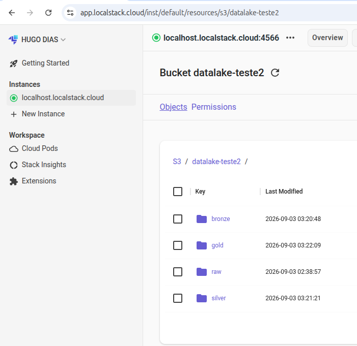
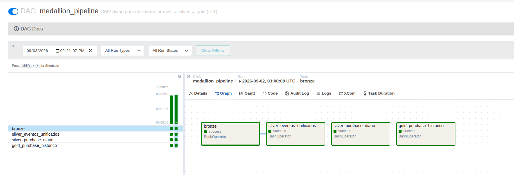

# Desafio Técnico — GMV diário por subsidiária

ETL sobre eventos de CDC de três fontes (`purchase`, `product_item`,
`purchase_extra_info`), entregando o **GMV diário por subsidiária** numa tabela
histórica e imutável.

O desenho de cada camada e o porquê de cada decisão estão em
**[MODELAGEM.md](MODELAGEM.md)**.

---

## O problema, em uma frase

As três fontes descrevem a mesma compra, mas **chegam em dias diferentes, em
ordem desconhecida, e podem corrigir o passado meses depois** — e mesmo assim o
GMV de um mês consultado hoje precisa bater com o mesmo mês consultado numa data
anterior.

---

## Stack

| Peça | Papel |
|---|---|
| **LocalStack** | S3 emulado — as camadas do data lake |
| **Terraform** | provisiona os buckets e prefixos |
| **PySpark 3.5** | processamento das camadas |
| **Airflow 2.9** | orquestração diária (D-1) |
| **Docker Compose** | amarra tudo |

Serving em produção seria **Glue Catalog + Athena** direto sobre o Parquet
(zero cópia). Redshift entraria só se a concorrência de BI ou a latência de
dashboard exigissem — carregar lá criaria uma segunda cópia a manter
sincronizada.

---

## Como executar

**Pré-requisitos:** Docker + Docker Compose. O `.env` precisa ter
`LOCALSTACK_AUTH_TOKEN` (o LocalStack Pro recusa subir sem ele).

```bash
make up-infra      # containers + Terraform cria os buckets
make seed          # deposita os CSVs de eventos em raw/
make run-bronze    # tipagem e particionamento
make run-silver    # união dos eventos + estado diário
make run-gold      # validade SCD2 — dataset final
```

O GMV é consultado em `jobs/query_final/consulta_gmv_segundo_exercicio.ipynb`,
que já vem com as saídas salvas — dá para ler sem executar nada. Resultado:

```
2023-02-28  internacional   2000.00
2023-03-01  nacional          55.00
2023-03-02  internacional    330.00
2023-03-19  internacional    750.00
2023-04-18  não informada    640.00
2023-05-22  internacional    480.00
2023-06-08  nacional         900.00
2023-06-25  internacional    150.00
```

> **Atenção:** derrubar o LocalStack apaga o S3. Depois de `make down`, é
> preciso rodar `make seed` de novo antes do pipeline — o Terraform recria os
> buckets, mas vazios.

### As camadas no S3

Ao final, o bucket `datalake-teste2` tem as quatro camadas — `raw` com os CSVs
de origem e `bronze`, `silver` e `gold` com o Parquet particionado por
`transaction_date`:



### Orquestração

```bash
make up-airflow    # UI em http://localhost:8081 (admin / admin)
```

Na UI, despause o DAG `medallion_pipeline` e dispare. As quatro tasks rodam em
sequência:

```
bronze → silver_eventos_unificados → silver_purchase_diario → gold_purchase_historico
```

O DAG está agendado para **03:00 diariamente**, com `catchup=False` e
`max_active_runs=1`.



As quatro tasks concluídas com `success` — a dependência é linear, então uma
falha no bronze impede que as demais rodem com dado incompleto.

---

## Estrutura

```
data/events/              os 3 CSVs de eventos (entrada)
jobs/
  bronze.py                       → bronze/{fonte}
  silver_eventos_unificado.py     → silver/eventos_unificados
  silver_purchase_diario.py       → silver/purchase_diario
  gold_purchase_historico.py      → gold/purchase_historico   ★ dataset final
  config/config.py                → caminhos S3 e SparkSession única
  query_final/                    → notebooks dos dois exercícios
  jupyter_validação/              → um notebook por camada, reproduzindo cada job
airflow/dags/pipeline_medallion.py
terraform/                        → buckets e prefixos
scripts/seed_data.py              → simula a origem entregando os CSVs
```

---
##  Primeiro Exercicio - Entregável
| O que foi pedido | Onde está |
|---|---|
| 2 querys em SQL. | `jobs/query_final/primeiro_exercicio.ipynb` |


## Segundo Exercicio - Entregáveis

| O que foi pedido | Onde está |
|---|---|
| Script do ETL | `jobs/*.py` + `airflow/dags/pipeline_medallion.py` |
| DDL do dataset final | schema gravado no Parquet; ver [MODELAGEM.md](MODELAGEM.md#gold) |
| Exemplo do dataset final populado | `jobs/query_final/consulta_gmv_segundo_exercicio.ipynb` |
| Consulta SQL do GMV diário | `jobs/query_final/consulta_gmv_segundo_exercicio.ipynb` |
| Descrição da tech stack | seção **Stack**, acima |


---

## Comandos

| Comando | O que faz |
|---|---|
| `make up` / `make down` | sobe / derruba os containers |
| `make seed` | deposita os CSVs de eventos em `raw/` |
| `make run-silver-eventos` | só a união dos eventos |
| `make run-silver-diario` | só o estado diário |
| `make logs` / `make logs-airflow` | logs do Spark / Airflow |
| `make tf-plan` / `tf-apply` / `tf-destroy` | Terraform |
| `make clean` | remove containers, volumes e dados |

